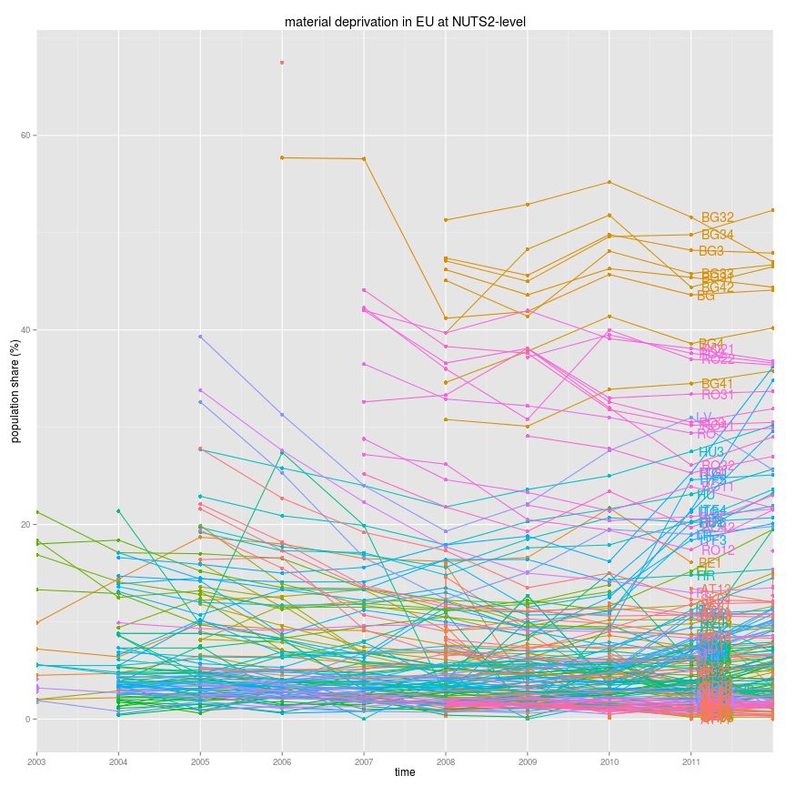

# Using SmarterPoland-package in accessing Eurostat data

[SmarterPoland-package](http://cran.r-project.org/web/packages/SmarterPoland/index.html) provides a straghtforward connection to Eurostat data. It is uninformatively described as:

>A set of tools developed by the Foundation SmarterPoland.pl
>Tools for accessing and processing datasets presented on the blog SmarterPoland.pl.

But in real terms it has functionality only towards Eurostat. Here is a brief demo how you can search for *material deprivation* and then create a line plot at NUTS2 level.

## Search


```r
library(SmarterPoland)
```

```
## Loading required package: reshape
## Loading required package: plyr
## 
## Attaching package: 'reshape'
## 
## The following objects are masked from 'package:plyr':
## 
##     rename, round_any
## 
## The following objects are masked from 'package:reshape2':
## 
##     colsplit, melt, recast
## 
## Loading required package: rjson
```

```r
searchresults <- grepEurostatTOC("material deprivation")
df <- getEurostatRCV(kod = "ilc_mddd21")
```


## Plot at nuts2-level


```r
# time variable into numerical
df$time <- as.numeric(levels(df$time))[df$time]
cname <- subset(df, time == 2011)

# plot
library(ggplot2)
ggplot(df, aes(x=time,y=value, color=geo,group=geo)) + 
  geom_point() + geom_line() +
  geom_text(data=cname, 
            aes(x=time,y=value,label=geo), hjust=-0.3) +
  theme(legend.position="none") +
  labs(title="material deprivation in EU at NUTS2-level",
       y="population share (%)") +
  coord_cartesian(xlim=c(2003,2012)) +
  scale_x_continuous(breaks = 2003:2011)
```

```
## Warning: Removed 854 rows containing missing values (geom_point).
## Warning: Removed 837 rows containing missing values (geom_path).
## Warning: Removed 14 rows containing missing values (geom_text).
```

 


## Plot at nuts1-level


```r
# subset geo-names only lenght of 2 characters
df$geo <- as.character(df$geo)
df$geo.n <- nchar(df$geo)
df <- subset(df, geo.n < 3)

cname <- subset(df, time == 2011)

# plot
library(ggplot2)
ggplot(df, aes(x=time,y=value, color=geo,group=geo)) + 
  geom_point() + geom_line() +
  geom_text(data=cname, 
            aes(x=time,y=value,label=geo), hjust=-0.3) +
  theme(legend.position="none") +
  labs(title="material deprivation in EU at NUTS2-level",
       y="population share (%)") +
  coord_cartesian(xlim=c(2003,2012)) +
  scale_x_continuous(breaks = 2003:2011)
```

```
## Warning: Removed 103 rows containing missing values (geom_point).
## Warning: Removed 93 rows containing missing values (geom_path).
## Warning: Removed 1 rows containing missing values (geom_text).
```

 


# Spatial visualisation

This is only a a brief description how to access and use spatial shapefiles of Europe published by EUROSTAT at [Administrative units / Statistical units](http://epp.eurostat.ec.europa.eu/portal/page/portal/gisco_Geographical_information_maps/popups/references/administrative_units_statistical_units_1). Here I'm using the 1:60 million scale Shapefile from year 2010.

As a plotted data we use the nuts2-level rates of material deprivation which we imported from EUROSTAT on page [SmarterPoland-package.](smarterpoland.html)

## Importing the data

Same code as in [SmarterPoland-package.](smarterpoland.html) excluding the plots.


```r
library(SmarterPoland)
df <- getEurostatRaw(kod = "ilc_mddd21")
#
names(df) <- c("xx", 2011:2003)

df$unit <- lapply(strsplit(as.character(df$xx), ","), "[", 1)
df$geo.time <- lapply(strsplit(as.character(df$xx), ","), "[", 2)

df.l <- melt(data = df, id.vars = "geo.time", measure.vars = c("2003", "2004", 
    "2005", "2006", "2007", "2008", "2009", "2010", "2011"))

df.l$geo.time <- unlist(df.l$geo.time)  # unlist the geo.time variable
```


## Load the GISCO shapefile, subset it to NUTS2-level and merge the Eurostat attribute data with it into single `SpatialPolygonDataFrame`


```r
download.file("http://epp.eurostat.ec.europa.eu/cache/GISCO/geodatafiles/NUTS_2010_60M_SH.zip", 
    destfile="NUTS_2010_60M_SH.zip")
# unzip to SpatialPolygonsDataFrame
unzip("NUTS_2010_60M_SH.zip")
library(rgdal)
```

```
## rgdal: version: 0.8-16, (SVN revision 498)
## Geospatial Data Abstraction Library extensions to R successfully loaded
## Loaded GDAL runtime: GDAL 1.7.3, released 2010/11/10
## Path to GDAL shared files: /usr/share/gdal/1.7
## GDAL does not use iconv for recoding strings.
## Loaded PROJ.4 runtime: Rel. 4.7.1, 23 September 2009, [PJ_VERSION: 470]
## Path to PROJ.4 shared files: (autodetected)
```

```r
map <- readOGR(dsn = "./NUTS_2010_60M_SH/data", layer = "NUTS_RG_60M_2010")
```

```
## OGR data source with driver: ESRI Shapefile 
## Source: "./NUTS_2010_60M_SH/data", layer: "NUTS_RG_60M_2010"
## with 1920 features and 4 fields
## Feature type: wkbPolygon with 2 dimensions
```

```r
# as the data is at NUTS2-level, we subset the spatialpolygondataframe
map_nuts2 <- subset(map, STAT_LEVL_ <= 2)
# dim show how many regions are in the spatialpolygondataframe
dim(map_nuts2)
```

```
## [1] 467   4
```

```r
# dim show how many regions are in the data.frame
dim(df)
```

```
## [1] 208  14
```

```r
# Spatial dataframe has 467 rows and attribute data 223. 
# We need to make attribute data to have similar number of rows
NUTS_ID <- as.character(map_nuts2$NUTS_ID)
VarX <- rep("empty", 467)
dat <- data.frame(NUTS_ID,VarX)
# then we shall merge this with Eurostat data.frame
dat2 <- merge(dat,df,by.x="NUTS_ID",by.y="geo.time", all.x=TRUE)
## merge this manipulated attribute data with the spatialpolygondataframe
# there are still duplicates in the data, remove them
dat2$dup <- duplicated(dat2$NUTS_ID)
dat3 <- subset(dat2, dup == FALSE)
## rownames
row.names(dat3) <- dat3$NUTS_ID
row.names(map_nuts2) <- as.character(map_nuts2$NUTS_ID)
## order data
dat3 <- dat3[order(row.names(dat3)), ]
map_nuts2 <- map_nuts2[order(row.names(map_nuts2)), ]
## join
library(maptools)
shape <- spCbind(map_nuts2, dat3)
```


## Munging the shapefile into data.frame and ready for ggplot-plotting


```r
## fortify spatialpolygondataframe into data.frame
library(ggplot2)
library(rgeos)
shape$id <- rownames(shape@data)
map.points <- fortify(shape, region = "id")
map.df <- merge(map.points, shape, by = "id")
# As we want to plot map faceted by years from 2003 to 2011
# we have to melt it into long format
library(reshape2)
map.df.l <- melt(data = map.df, id.vars = c("id","long","lat","group"), 
                 measure.vars = c("X2003", "X2004",
                                  "X2005", "X2006", 
                                  "X2007", "X2008", 
                                  "X2009", "X2010", "X2011"))
# year variable (variable) is class string and type X20xx. 
# Lets remove the X and convert it to numerical
library(stringr)
map.df.l$variable <- str_replace_all(map.df.l$variable, "X","")
map.df.l$variable <- factor(map.df.l$variable)
map.df.l$variable <- as.numeric(levels(map.df.l$variable))[map.df.l$variable]
```


## And finally the plot using ggplot2

Map shows proportion of materially deprived households at the NUTS2 level. Grey color indicates missing data.


```r
library(ggplot2)
# plot faceted by year
ggplot(map.df.l, aes(long,lat,group=group)) +
  geom_polygon(aes(fill = value)) +
  geom_polygon(data = map.df.l, aes(long,lat), 
               fill=NA, 
               color = "white",
               size=0.1) + # white borders
  coord_map(project="orthographic", xlim=c(-22,34),
              ylim=c(35,70)) + # projection
  facet_wrap(~variable, ncol=2) +
  theme_minimal()
```

 

