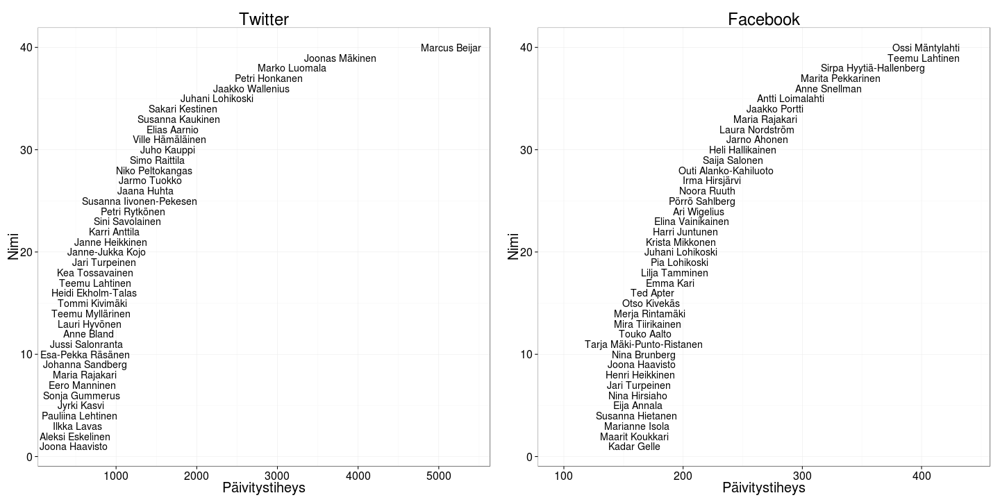
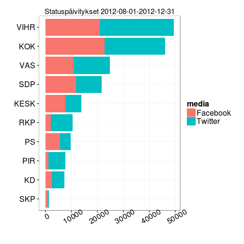
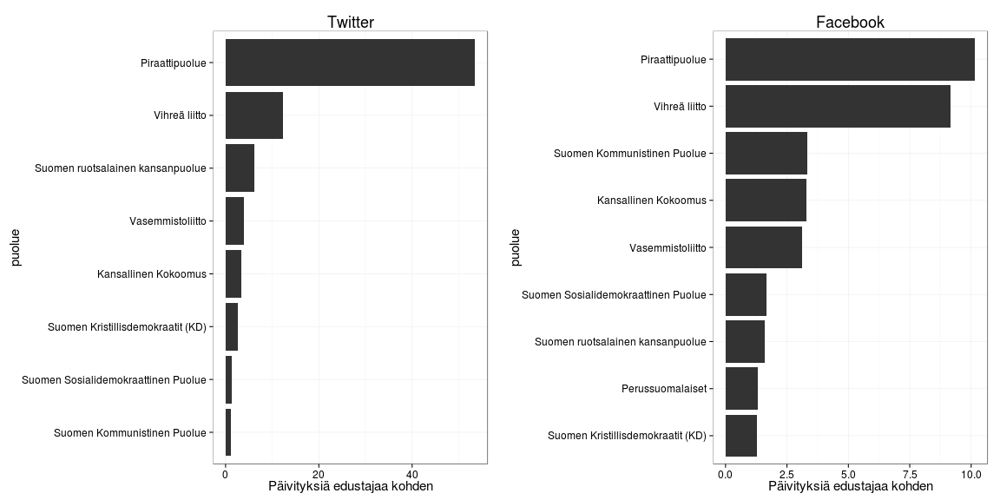

# Kunnallisvaalit 2012

Seuraavat esimerkit visualisoivat R-ympäristössä kunnallisvaaliehdokkaiden aktiivisuutta sosiaalisessa mediassa 2012. Lähde: [Louhos-blogi](https://louhos.wordpress.com/2012/10/26/kunnallisvaaliehdokkaiden-aktiivisuus-sosiaalisessa-mediassa-puolueiden-vertailua/).

Aloitetaan hakemalla CSV-dumppi Datavaalit-palvelimelta ja muuta vaalidataa.


```r
# sorvi installation: http://louhos.github.com/sorvi/asennus.html
library(sorvi)
library(ggplot2)

# Download and unpack social media aggregate data dump
url <- "http://www.datavaalit.fi/storage/avoindata/datavaalit-data/some-aggregaatti/some-updates-2013-01-22.csv.bz2"
download.file(url, destfile = "some-updates.csv.bz2")

# Read table and name the columns
tsome <- read.csv(bzfile("some-updates.csv.bz2"), sep = ";", header = FALSE)
names(tsome) <- c("nimi", "puolue", "kunta", "sukupuoli", "media", "aika")

# Pick the 2012 updates
tsome <- tsome[grep("2012", tsome$aika),]
tsome$media <- gsub("FB", "Facebook", tsome$media)
tsome$media <- gsub("TW", "Twitter", tsome$media)
tsome$media <- factor(tsome$media)

# Aktiivisimmat some-puolueet
isot <- names(which(table(tsome$puolue) > 1000))

# Hae 2012 kunnallisvaalien puoluetietoja
# Lähde: (C) Oikeusministeriö:
# http://192.49.229.35/K2012/s/ehd_listat/kokomaa.htm#ladattavat
# Load party information (C) Oikeusministeriö 2012
parties.all <- ReadAllParties()

# Hae kunnallisvaalien ehdokastiedot Datavaalit-palvelimelta
# Lähde: Datavaalit ja Tilastokeskus
# ks. http://louhos.wordpress.com/2012/10/05/kunnallisvaalien-vertailukelpoiset-ehdokasdatat-csv-taulukkoina-2004-2008-2012/
cand <- read.csv2("http://www.datavaalit.fi/storage/avoindata/datavaalit-ehdokas-ja-tulostiedot/2012/municipal_elections_candidates_2012_finland.csv", sep = ";", fileEncoding = "iso-8859-1")
cand.per.party <- sort(table(cand$Puolue_lyhenne_fi))
```


## Sosiaalisen median päivitystiheydet aikasarjana


```r
theme_set(theme_bw(20))
tsome$aika <- as.Date(tsome$aika)
tsome <- subset(tsome, puolue %in% isot)
tsome$puolue <- droplevels(tsome$puolue)

pics <- list()
for (me in c("Twitter", "Facebook")) {

  tsome.sub <- subset(tsome, media == me)
  p <- ggplot(tsome.sub, aes(x = aika))
  p <- p + geom_histogram(binaxis = "y", binwidth=1, fill="#3B5998") + ylab("lkm") + facet_grid(puolue ~ .) + ggtitle(me) + scale_x_date() + xlab("") + ylab("")
  pics[[me]] <- p
}
library(gridExtra)
grid.arrange(pics[[1]], pics[[2]], nrow = 1)
```


## Aktiivisimmat statuspäivittäjät


```r
theme_set(theme_bw(20))
pics <- list()

for (me in c("Twitter", "Facebook")) {
  dfs <- data.frame(list(count = table(subset(tsome, media == me)$nimi)))
  dfs <- dfs[rev(order(dfs$count.Freq)),]
  dfs$ind <- 1:nrow(dfs)
  n <- 40
  pics[[me]] <- ggplot(data = dfs[1:n,], aes(x = rev(ind), y = count.Freq)) + geom_text(aes(label = count.Var1), size = 5) + ggtitle(me) + scale_x_continuous(limits = c(1, n)) + scale_y_continuous(limits = c(0.6*min(dfs[1:n, "count.Freq"]), 1.04*max(dfs[1:n, "count.Freq"]) + 20)) + coord_flip() + ylab("Päivitystiheys") + xlab("Nimi")

}

grid.arrange(pics[[1]], pics[[2]], nrow = 1)
```

 


## Puolueiden aktiivisuus sosiaalisessa mediassa (absoluuttinen lukumäärä)


```r

stsome <- subset(tsome, puolue %in% isot)
stsome$puolue <- factor(stsome$puolue, level = names(sort(table(stsome$puolue))))

p <- ggplot(stsome, aes(x = puolue, fill = media, group = media)) + geom_bar(stat = "bin", position = "stack") + ylab("") + xlab("") + ggtitle(paste("Statuspäivitykset", paste(sort(tsome$aika)[[1]], "-", rev(sort(tsome$aika))[[1]], sep = ""))) + theme(axis.text.x=element_text(angle=30), plot.title = element_text(size = 15)) + coord_flip()

print(p)
```

 


## Puolueitten aktiivisuus sosiaalisessa mediassa (edustajaa kohden)

Erot puolueiden ehdokasmäärissä on huomiotu laskemalla Facebook-viestien määrä ehdokasta kohden. Visualisointien selkeyttämiseksi poistetaan puolueet, joilla on vain yksi ehdokas.


```r
# Laske some-aktiivisuus ehdokasta kohden
# (= normalisoi data puolueiden ehdokasmäärillä)
library(reshape)
some <- melt(table(tsome[, c("puolue", "media")]))

pics <- list()
for (me in c("Twitter", "Facebook")) {
  msome <- subset(some, media == me)

  msome$normalized <- msome$value/cand.per.party[as.character(msome$puolue)]
  msome$candidates <- cand.per.party[as.character(msome$puolue)]

  # Poista yhden ehdokkaan puolueet
  msome <- subset(msome, candidates > 1)

  # Poista puolueet joilla ei mainittavaa aktiivisuutta
  msome <- subset(msome, normalized > 1)
  
  # puolueen lyhenne ja koko nimi
  msome$puolue.lyh <- droplevels(msome$puolue)
  msome$puolue <- parties.all$Nimi_fi[match(as.character(msome$puolue), parties.all$Puolue_lyhenne_fi)]

  # Aseta puolueet suuruusjärjestykseen some-aktiivisuuden nojalla
  msome <- msome[rev(order(msome$normalized)),]
  msome$puolue <- factor(msome$puolue, levels = rev(as.character(msome$puolue)))

  # Visualisoi some-aktiisuus edustajaa kohden
  library(ggplot2)
  theme_set(theme_bw(15))
  msome$Paivitykset.edustajaa.kohden <- msome$normalized
  p <- ggplot(msome, aes(x = puolue, y = Paivitykset.edustajaa.kohden, group = media)) + geom_bar(stat = "identity") + coord_flip() + ggtitle(paste(me)) + ylab("") + ylab("Päivityksiä edustajaa kohden")
  pics[[me]] <- p
}

grid.arrange(pics[[1]], pics[[2]], nrow = 1)
```

 


## Miehet twiittaa, naiset facebookkaa


```r
p <- ggplot(tsome, aes(x = media, fill = sukupuoli, group = sukupuoli)) + geom_bar(stat = "bin", position = "stack") + ylab("") + xlab("") + scale_fill_manual(name = "", values = c("gray", "red", "blue")) + ggtitle(paste("Statuspäivitykset", paste(sort(tsome$aika)[[1]], "-", rev(sort(tsome$aika))[[1]], sep = ""))) + theme(plot.title = element_text(size = 15))

print(p)
```

 

