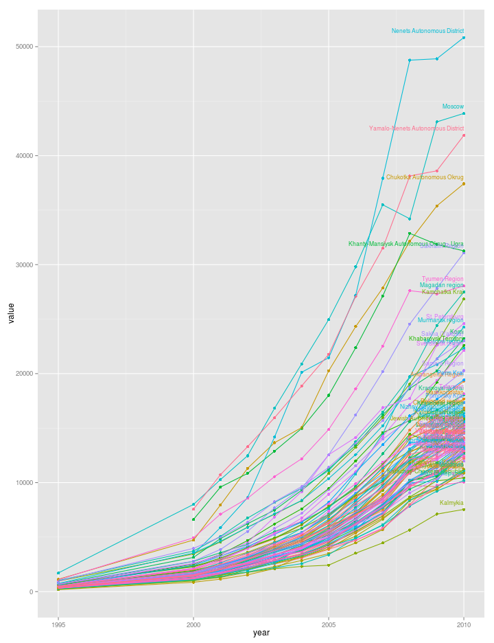

## Rosstat regional statistics

Function `IndicatorRosstat()` returns a dataset with available indicators and metadata in Russian and English


```r
ind <- IndicatorRosstat()
ind[1:3,1:3]
```


[Rosstat regional statistic](http://www.gks.ru/wps/wcm/connect/rosstat_main/rosstat/ru/statistics/publications/catalog/doc_1138623506156) includes values of the indicators on three levels:

1. federal level
2. federal district level
3. regional level

To dowload the data you may use `GetRosstat()`-function that requires two arguments,

1. `indicator` (from the listing above),
2. `level` (federal/federal_district/region)

The code below returns a dataset at **federal district level** on **infant mortality** and plots a line graph over time.


```r
library(rustfare)
dat <- GetRosstat("average_percapita_income", "region")
library(ggplot2)
ggplot(dat, aes(x = year, y = value, color = region_en)) + geom_point() + geom_line() +
geom_text(data = merge(dat, aggregate(year ~ region_en, dat, max),
by = c("year","region_en")),
aes(x = year, y = value, label = region_en), hjust = 1, vjust = -1,
size = 3) + theme(legend.position = "none")
```

```
## Warning: Removed 3 rows containing missing values (geom_point).
## Warning: Removed 3 rows containing missing values (geom_path).
```

 


```r
# cast the data into wide format
library(reshape2)
dat.w <- dcast(dat, region_en + id_shape ~ year, value.var = "value")

shape <- GetRusGADM("region")
library(maptools)
dat.w <- dat.w[!is.na(dat.w$id_shape), ]
row.names(dat.w) <- dat.w$id_shape
row.names(shape) <- as.character(shape$ID_1)
dat.w <- dat.w[order(row.names(dat.w)), ]
shape <- shape[order(row.names(shape)), ]
# from above
difference <- setdiff(row.names(shape), row.names(dat.w))
shape <- shape[!row.names(shape) %in% difference, ]
# 
df <- spCbind(shape, dat.w)

library(ggplot2)
library(rgeos)
df$id <- rownames(df@data)
map.points <- fortify(df, region = "id")
map.df <- merge(map.points, df, by = "id")

library(reshape2)
map.df.l <- melt(data = map.df, id.vars = c("id", "long", "lat", "group"), 
                 measure.vars = c("X2000", 
    "X2005", "X2009"))

map.df.l <- melt(data = map.df, id.vars = c("id", "long", "lat", "group"), 
                 measure.vars = c("X1995","X2000","X2001",
                                  "X2002","X2003","X2004",
                                  "X2005","X2006","X2007",
                                  "X2008","X2009","X2010"))
# lets tweak a bit and remove X's from year values and make it into
# numerical
map.df.l$variable <- str_replace_all(map.df.l$variable, "X", "")
map.df.l$variable <- factor(map.df.l$variable)
map.df.l$variable <- as.numeric(levels(map.df.l$variable))[map.df.l$variable]

ggplot(map.df.l, aes(long,lat,group=group)) +
  geom_polygon(aes(fill = value)) +
  geom_polygon(data = map.df.l, aes(long,lat), 
               fill=NA, 
               color = "white",
               size=0.1) + # white borders
  coord_map(project="orthographic",
            xlim=c(25,170),
              ylim=c(45,70)) +
  facet_wrap(~variable, ncol=1) +
  theme_minimal()
```

 

