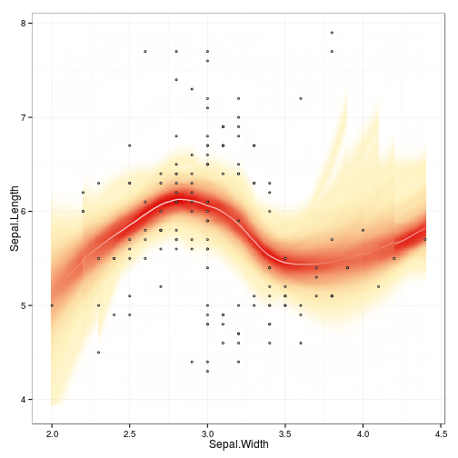

Finnish open government data toolkit for R
===========

This is an R package for Finnish open government data. New
contributions are [welcome!](http://louhos.github.com/contact.html).

This work is part of the [rOpenGov](http://ropengov.github.com)
project.


## Installation

General users (CRAN release version):


```r
install.packages("sorvi")
library(sorvi)
```


Developers (Github development version):


```r
install.packages("devtools")
library(devtools)
install_github("sorvi", "ropengov")
library(sorvi)
```


Further installation and development instructions can be found at the
project [home page](http://ropengov.github.com/sorvi).


## Using the package

For further usage
examples, see [Louhos-blog](http://louhos.wordpress.com) and
[Datawiki](https://github.com/louhos/sorvi/wiki/Data).


### Personal identification number (HETU)

Extracting information from a Finnish personal identification number:


```r
library(sorvi)
hetu("111111-111C")
```

```
## $hetu
## [1] "111111-111C"
## 
## $gender
## [1] "Male"
## 
## $personal.number
## [1] 111
## 
## $checksum
## [1] "C"
## 
## $date
## [1] "1911-11-11"
## 
## $day
## [1] 11
## 
## $month
## [1] 11
## 
## $year
## [1] 1911
## 
## $century.char
## [1] "-"
## 
## attr(,"class")
## [1] "hetu"
```


Validating Finnish personal identification number:


```r
valid.hetu("010101-0101") # TRUE/FALSE
```

```
## [1] TRUE
```


### Postal codes

Get Finnish postal codes vs. municipalities table from Wikipedia


```r
postal.code.table <- GetPostalCodeInfo()
head(postal.code.table)
```

```
##   postal.code municipality municipality.ascii
## 1       07230       Askola             Askola
## 2       07500       Askola             Askola
## 3       07510       Askola             Askola
## 4       07530       Askola             Askola
## 5       07580       Askola             Askola
## 6       07590       Askola             Askola
```


### IP Location

Get geographic coordinates for a given IP-address from
http://www.datasciencetoolkit.org//ip2coordinates/


```r
ip_location("137.224.252.10")
```

```
## Error: could not find function "ip_location"
```


### Municipality information

Finnish municipality information is available through Population
Registry (Vaestorekisterikeskus), Statistics Finland (Tilastokeskus)
and Land Survey Finland (Maanmittauslaitos). We provide separate
download routine for each data set. The row names are in harmonized
format and can be used to match data sets from different sources, as
different data sets may carry slightly different versions of certain
municipality names. Examples for each case:

Finnish municipality information from Land Survey Finland ([Maanmittauslaitos, MML](http://www.maanmittauslaitos.fi/aineistot-palvelut/latauspalvelut/avoimien-aineistojen-tiedostopalvelu)).


```r
municipality.info.mml <- GetMunicipalityInfoMML()
```

```
## Error: cannot open the connection
```

```r
municipality.info.mml[1:2,]
```

```
## Error: object 'municipality.info.mml' not found
```


Get information of Finnish provinces from Statistics Finland ([Tilastokeskus](http://pxweb2.stat.fi/Database/Kuntien%20perustiedot/Kuntien%20perustiedot/Kuntaportaali.px))


```r
municipality.info.statfi <- GetMunicipalityInfoStatFi()
municipality.info.statfi[1:2,]
```

```
##              Alue Maapinta-ala, km2 1.1.2013 Taajama-aste, % 1.1.2012
## Akaa         Akaa                        293                     86.9
## Alajärvi Alajärvi                       1009                     59.7
##          Väkiluku 31.12.2012 Väkiluvun muutos, % 2011 - 2012
## Akaa                   17134                             0.3
## Alajärvi               10268                            -0.6
##          0-14 -vuotiaiden osuus väestöstä, % 31.12.2012
## Akaa                                               18.7
## Alajärvi                                           18.5
##          15-64 -vuotiaiden osuus väestöstä, % 31.12.2012
## Akaa                                                62.5
## Alajärvi                                            59.5
##          65 vuotta täyttäneiden osuus väestöstä, % 31.12.2012
## Akaa                                                     18.8
## Alajärvi                                                 22.0
##          Ruotsinkielisten osuus väestöstä, % 31.12.2012
## Akaa                                                0.2
## Alajärvi                                            0.1
##          Ulkomaiden kansalaisten osuus väestöstä, % 31.12.2012
## Akaa                                                       1.4
## Alajärvi                                                   1.9
##          Kuntien välinen muuttovoitto/-tappio, henkilöä 2012
## Akaa                                                     -21
## Alajärvi                                                 -94
##          Syntyneiden enemmyys, henkilöä 2012
## Akaa                                      50
## Alajärvi                                 -12
##          Perheiden lukumäärä 31.12.2012
## Akaa                               4782
## Alajärvi                           2779
##          Valtionveronalaiset tulot, euroa/tulonsaaja  2011
## Akaa                                                 25041
## Alajärvi                                             21729
##          Asuntokuntien lukumäärä 31.12.2012
## Akaa                                   7767
## Alajärvi                               4152
##          Vuokra-asunnossa asuvien asuntokuntien osuus, % 31.12.2012
## Akaa                                                           19.7
## Alajärvi                                                       15.9
##          Rivi- ja pientaloissa asuvien asuntokuntien osuus asuntokunnista, % 31.12.2012
## Akaa                                                                               71.9
## Alajärvi                                                                           91.4
##          Kesämökkien lukumäärä 31.12.2012
## Akaa                                  886
## Alajärvi                             1300
##          Vähintään keskiasteen tutkinnon suorittaneiden osuus 15 vuotta täyttäneistä, % 31.12.2011
## Akaa                                                                                          64.9
## Alajärvi                                                                                      59.6
##          Korkea-asteen tutkinnon suorittaneiden osuus 15 vuotta täyttäneistä, % 31.12.2011
## Akaa                                                                                  22.8
## Alajärvi                                                                              19.0
##          Kunnassa olevien työpaikkojen lukumäärä 31.12.2011
## Akaa                                                   5000
## Alajärvi                                               3729
##          Työllisten osuus 18-74-vuotiaista, % 31.12.2011
## Akaa                                                61.5
## Alajärvi                                            54.9
##          Työttömyysaste, % 31.12.2011
## Akaa                             10.9
## Alajärvi                         11.5
##          Kunnassa asuvan työllisen työvoiman määrä 31.12.2011
## Akaa                                                     7243
## Alajärvi                                                 3754
##          Asuinkunnassaan työssäkäyvien osuus työllisestä työvoimasta, % 31.12. 2011
## Akaa                                                                           50.6
## Alajärvi                                                                       78.8
##          Alkutuotannon työpaikkojen osuus, % 31.12.2011
## Akaa                                                4.0
## Alajärvi                                           12.6
##          Jalostuksen työpaikkojen osuus, % 31.12.2011
## Akaa                                             36.1
## Alajärvi                                         28.1
##          Palvelujen työpaikkojen osuus, % 31.12.2011
## Akaa                                            58.3
## Alajärvi                                        57.4
##          Toimialaltaan tuntemattomien työpaikkojen osuus, % 31.12.2011
## Akaa                                                               1.6
## Alajärvi                                                           1.9
##          Taloudellinen huoltosuhde, työvoiman ulkopuolella tai työttömänä olevat yhtä työllistä kohti 31.12.2011
## Akaa                                                                                                        1.36
## Alajärvi                                                                                                    1.75
##          Eläkkeellä olevien osuus väestöstä, % 31.12.2011
## Akaa                                                 24.5
## Alajärvi                                             29.0
##          Yritystoimipaikkojen lukumäärä 2012 Kunta.Tilastokeskus    Kunta
## Akaa                                    1003                Akaa     Akaa
## Alajärvi                                 932            Alajärvi Alajärvi
```


List the province for each municipality in Finland:

```r

# Specific municipalities
m2p <- FindProvince(c("Helsinki", "Tampere", "Turku"))
```

```
## Error: cannot open the connection
```

```r
head(m2p)
```

```
## Error: error in evaluating the argument 'x' in selecting a method for function 'head': Error: object 'm2p' not found
```

```r

# All municipalities
m2p <- FindProvince(municipality.info.statfi$Kunta)
```

```
## Error: cannot open the connection
```

```r

# Speeding up with predefined municipality info table:
m2p <- FindProvince(c("Helsinki", "Tampere", "Turku"), municipality.info.mml)
```

```
## Error: object 'municipality.info.mml' not found
```

```r
head(m2p)
```

```
## Error: error in evaluating the argument 'x' in selecting a method for function 'head': Error: object 'm2p' not found
```


Convert municipality codes and names:

```r
municipality_ids <- ConvertMunicipalityCodes()
head(municipality_ids)
```

```
##    id       name
## 1 890    Utsjoki
## 2 854      Pello
## 3 976  Ylitornio
## 4 845    Tervola
## 5 620   Puolanka
## 6 105 Hyrynsalmi
```


Translate municipality names Finnish/English:


```r
translations <- LoadData("translations")
head(translations)
```

```
##   Ã\u0085land Islands         South Karelia Southern Ostrobothnia 
##          "Ahvenanmaa"      "EtelÃĪ-Karjala"    "EtelÃĪ-Pohjanmaa" 
##      Southern Savonia                Kainuu       Tavastia Proper 
##         "EtelÃĪ-Savo"              "Kainuu"         "Kanta-HÃĪme"
```


### Retrieve population register data

Municipality-level population information from [Vaestorekisterikeskus](http://vrk.fi/default.aspx?docid=5127&site=3&id=0):


```r
df <- GetPopulationRegister()
head(df)
```

```
##           Koodi     Kunta    Kommun Miehet Naiset Yhteensa
## Akaa        020      Akaa      Akaa   8452   8637    17089
## Alajärvi   005  Alajärvi  Alajärvi   5226   5214    10440
## Alavieska   009 Alavieska Alavieska   1420   1350     2770
## Alavus      010    Alavus    Alavus   4619   4634     9253
## Asikkala    016  Asikkala  Asikkala   4217   4291     8508
## Askola      018    Askola    Askola   2489   2427     4916
```


### Province information

Get information of Finnish provinces from Wikipedia:


```r
tab <- GetProvinceInfoWikipedia()
```

```
## Error: could not find function "GetProvinceInfoWikipedia"
```

```r
head(tab)
```

```
## Error: error in evaluating the argument 'x' in selecting a method for function 'head': Error: object 'tab' not found
```


### Company subsidies from the Finnish government

Finnish broadcasting company YLE published a large data set on Finnish company subsidies ([(C) MOT 10.9.2012](http://ohjelmat.yle.fi/mot/10_9) over 15 years. See the site for more information; CC-BY-SA 3.0-license.


```r
tuet <- GetMOTYritystuet()
```

```
## Error: could not find function "GetMOTYritystuet"
```

```r
head(tuet)
```

```
## Error: error in evaluating the argument 'x' in selecting a method for function 'head': Error: object 'tuet' not found
```


### Visualization routines

Line fit with confidence smoothers:


```r
library(sorvi);
data(iris);
p <- vwReg(Sepal.Length ~ Sepal.Width, iris)
```

```
## 
  |                                                                       
  |                                                                 |   0%
  |                                                                       
  |=                                                                |   1%
  |                                                                       
  |=                                                                |   2%
  |                                                                       
  |==                                                               |   2%
  |                                                                       
  |==                                                               |   3%
  |                                                                       
  |==                                                               |   4%
  |                                                                       
  |===                                                              |   4%
  |                                                                       
  |===                                                              |   5%
  |                                                                       
  |====                                                             |   6%
  |                                                                       
  |=====                                                            |   7%
  |                                                                       
  |=====                                                            |   8%
  |                                                                       
  |======                                                           |   8%
  |                                                                       
  |======                                                           |   9%
  |                                                                       
  |======                                                           |  10%
  |                                                                       
  |=======                                                          |  10%
  |                                                                       
  |=======                                                          |  11%
  |                                                                       
  |=======                                                          |  12%
  |                                                                       
  |========                                                         |  12%
  |                                                                       
  |========                                                         |  13%
  |                                                                       
  |=========                                                        |  14%
  |                                                                       
  |==========                                                       |  15%
  |                                                                       
  |==========                                                       |  16%
  |                                                                       
  |===========                                                      |  16%
  |                                                                       
  |===========                                                      |  17%
  |                                                                       
  |===========                                                      |  18%
  |                                                                       
  |============                                                     |  18%
  |                                                                       
  |============                                                     |  19%
  |                                                                       
  |=============                                                    |  20%
  |                                                                       
  |==============                                                   |  21%
  |                                                                       
  |==============                                                   |  22%
  |                                                                       
  |===============                                                  |  22%
  |                                                                       
  |===============                                                  |  23%
  |                                                                       
  |===============                                                  |  24%
  |                                                                       
  |================                                                 |  24%
  |                                                                       
  |================                                                 |  25%
  |                                                                       
  |=================                                                |  26%
  |                                                                       
  |==================                                               |  27%
  |                                                                       
  |==================                                               |  28%
  |                                                                       
  |===================                                              |  28%
  |                                                                       
  |===================                                              |  29%
  |                                                                       
  |===================                                              |  30%
  |                                                                       
  |====================                                             |  30%
  |                                                                       
  |====================                                             |  31%
  |                                                                       
  |====================                                             |  32%
  |                                                                       
  |=====================                                            |  32%
  |                                                                       
  |=====================                                            |  33%
  |                                                                       
  |======================                                           |  34%
  |                                                                       
  |=======================                                          |  35%
  |                                                                       
  |=======================                                          |  36%
  |                                                                       
  |========================                                         |  36%
  |                                                                       
  |========================                                         |  37%
  |                                                                       
  |========================                                         |  38%
  |                                                                       
  |=========================                                        |  38%
  |                                                                       
  |=========================                                        |  39%
  |                                                                       
  |==========================                                       |  40%
  |                                                                       
  |===========================                                      |  41%
  |                                                                       
  |===========================                                      |  42%
  |                                                                       
  |============================                                     |  42%
  |                                                                       
  |============================                                     |  43%
  |                                                                       
  |============================                                     |  44%
  |                                                                       
  |=============================                                    |  44%
  |                                                                       
  |=============================                                    |  45%
  |                                                                       
  |==============================                                   |  46%
  |                                                                       
  |===============================                                  |  47%
  |                                                                       
  |===============================                                  |  48%
  |                                                                       
  |================================                                 |  48%
  |                                                                       
  |================================                                 |  49%
  |                                                                       
  |================================                                 |  50%
  |                                                                       
  |=================================                                |  50%
  |                                                                       
  |=================================                                |  51%
  |                                                                       
  |=================================                                |  52%
  |                                                                       
  |==================================                               |  52%
  |                                                                       
  |==================================                               |  53%
  |                                                                       
  |===================================                              |  54%
  |                                                                       
  |====================================                             |  55%
  |                                                                       
  |====================================                             |  56%
  |                                                                       
  |=====================================                            |  56%
  |                                                                       
  |=====================================                            |  57%
  |                                                                       
  |=====================================                            |  58%
  |                                                                       
  |======================================                           |  58%
  |                                                                       
  |======================================                           |  59%
  |                                                                       
  |=======================================                          |  60%
  |                                                                       
  |========================================                         |  61%
  |                                                                       
  |========================================                         |  62%
  |                                                                       
  |=========================================                        |  62%
  |                                                                       
  |=========================================                        |  63%
  |                                                                       
  |=========================================                        |  64%
  |                                                                       
  |==========================================                       |  64%
  |                                                                       
  |==========================================                       |  65%
  |                                                                       
  |===========================================                      |  66%
  |                                                                       
  |============================================                     |  67%
  |                                                                       
  |============================================                     |  68%
  |                                                                       
  |=============================================                    |  68%
  |                                                                       
  |=============================================                    |  69%
  |                                                                       
  |=============================================                    |  70%
  |                                                                       
  |==============================================                   |  70%
  |                                                                       
  |==============================================                   |  71%
  |                                                                       
  |==============================================                   |  72%
  |                                                                       
  |===============================================                  |  72%
  |                                                                       
  |===============================================                  |  73%
  |                                                                       
  |================================================                 |  74%
  |                                                                       
  |=================================================                |  75%
  |                                                                       
  |=================================================                |  76%
  |                                                                       
  |==================================================               |  76%
  |                                                                       
  |==================================================               |  77%
  |                                                                       
  |==================================================               |  78%
  |                                                                       
  |===================================================              |  78%
  |                                                                       
  |===================================================              |  79%
  |                                                                       
  |====================================================             |  80%
  |                                                                       
  |=====================================================            |  81%
  |                                                                       
  |=====================================================            |  82%
  |                                                                       
  |======================================================           |  82%
  |                                                                       
  |======================================================           |  83%
  |                                                                       
  |======================================================           |  84%
  |                                                                       
  |=======================================================          |  84%
  |                                                                       
  |=======================================================          |  85%
  |                                                                       
  |========================================================         |  86%
  |                                                                       
  |=========================================================        |  87%
  |                                                                       
  |=========================================================        |  88%
  |                                                                       
  |==========================================================       |  88%
  |                                                                       
  |==========================================================       |  89%
  |                                                                       
  |==========================================================       |  90%
  |                                                                       
  |===========================================================      |  90%
  |                                                                       
  |===========================================================      |  91%
  |                                                                       
  |===========================================================      |  92%
  |                                                                       
  |============================================================     |  92%
  |                                                                       
  |============================================================     |  93%
  |                                                                       
  |=============================================================    |  94%
  |                                                                       
  |==============================================================   |  95%
  |                                                                       
  |==============================================================   |  96%
  |                                                                       
  |===============================================================  |  96%
  |                                                                       
  |===============================================================  |  97%
  |                                                                       
  |===============================================================  |  98%
  |                                                                       
  |================================================================ |  98%
  |                                                                       
  |================================================================ |  99%
  |                                                                       
  |=================================================================| 100%
## [1] "Build ggplot figure ..."
```

```r
print(p)
```

 


Plot matrix:


```r
mat <- rbind(c(1,2,3), c(1, 3, 1), c(4,2,2));
pm <- PlotMatrix(mat, "twoway", midpoint = 2)
```

 

```r

# Plotting the scale
# sc <- PlotScale(pm$colors, pm$breaks)
```


# Väestörekisteritietojen visualisointi

Tämä esimerkki hakee Suomen kuntarajat ja vaestorekisterin asukaslukutiedot kunnittain, ja laskee sekä visualisoi sukupuolten suhteellisen osuuden eri kunnissa Suomen kartalla. Lähde: [Louhos-blogi](https://louhos.wordpress.com/2011/10/09/r-paketti-avoimen-suomi-datan-louhintaan/).


```r
library(sorvi)

# hae suomen kartta ja kuntarajat gadm-muodossa
library(gisfi)
gadm <- GetGADM("FIN_adm", "Kunta")
```

```
## [1] "gadm"
```

```r

# vaestorekisterin asukasluvut kunnittain
vrek <- GetPopulationRegister()

# Liita vaestorekisterin tiedot karttaobjektiin ja
# aseta nollaan asukasluku kunnissa joiden osalta se ei ole tiedossa
gadm$asukkaita <- log10(rowSums(vrek[gadm$Kunta, c("Miehet", "Naiset")]))
gadm$asukkaita[is.na(gadm$asukkaita)] <- 0
# Laske myos sukupuolten suhteellinen osuus
gadm$miehet.osuus <- vrek[gadm$Kunta, "Miehet"]/vrek[gadm$Kunta, "Yhteensa"]
gadm$naiset.osuus <- vrek[gadm$Kunta, "Naiset"]/vrek[gadm$Kunta, "Yhteensa"]
# Aseta arvoon 50% miesten/naisten osuus
# kunnissa joiden osalta vakiluku ei ole tiedossa
gadm$miehet.osuus[is.na(gadm$miehet.osuus)] <- 0.5
gadm$naiset.osuus[is.na(gadm$naiset.osuus)] <- 0.5

# paletin rajapisteet
varname <- "naiset.osuus"
interval <- max(abs(gadm[[varname]] - 0.5))
at <- seq(0.5 - interval, 0.5 + interval, length = 100)

# Piirra Suomen kartta varitettyna naisten suhteellisen osuuden nojalla
q <- PlotShape(gadm, varname, type = "twoway",
      at = at, main = "Naiset Suomen kunnissa")
```

 

